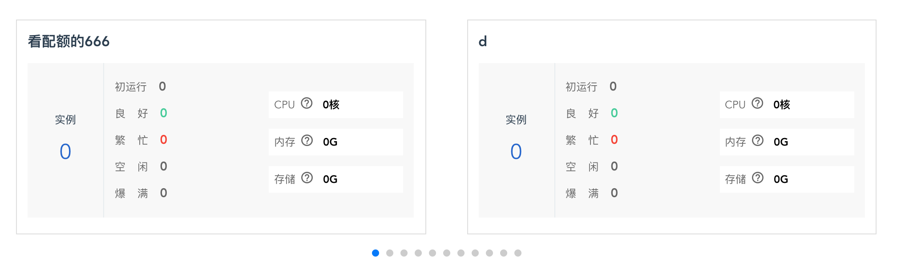
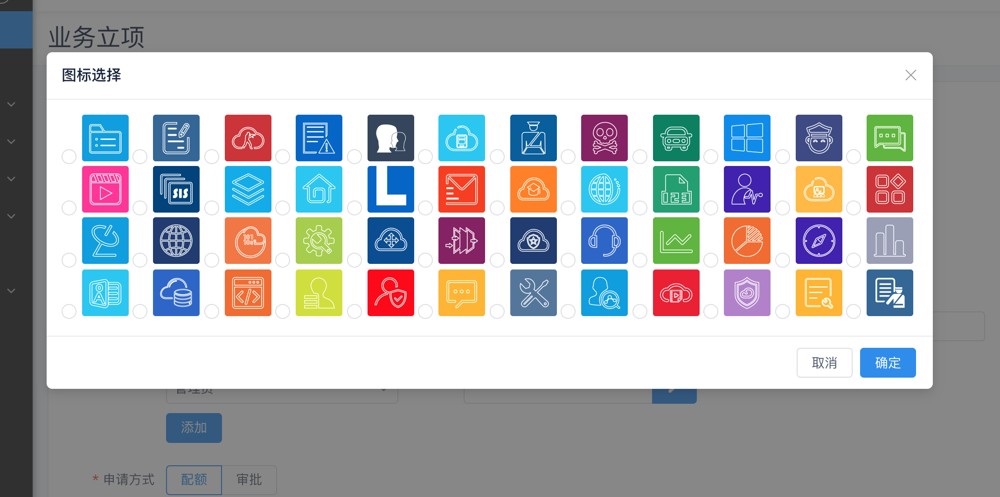
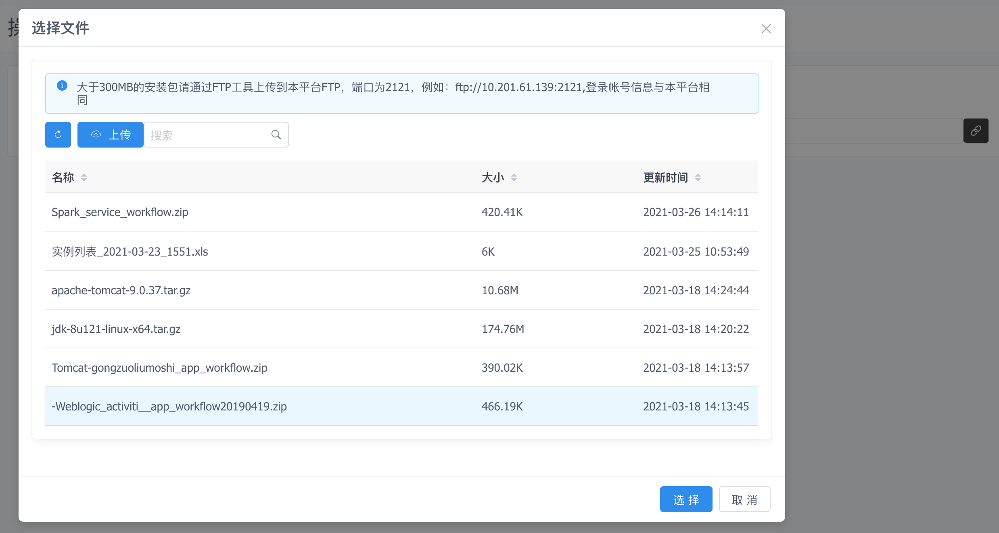

# Iaas模块组件

## 滑动组件

### 示例


``` 
 <swiper :options="swiperOption">
    <swiper-slide ></swiper-slide>
 </swiper> 
```
### 代码
``` 
import { swiper, swiperSlide } from 'vue-awesome-swiper';

swiperOption = {
    slidesPerView: 2,
    spaceBetween: 30,
    slidesPerGroup: 2,
    pagination: {
        el: '.swiper-pagination',
        clickable: true,
        uniqueNavElements: false
    }
}
```


### API

 [更多API](https://3.swiper.com.cn/api/Slides_grid/2015/0308/198.html)  

| 属性 | 说明 |
| ------ | ------ | 
| slidesPerView | 设置slider容器能够同时显示的slides数量 | 
| container | Swiper的容器，里面包括滑动块（slides）的封套（wrapper)、分页器(pagination)、前进按钮等 | spaceBetween | slide之间的距离 |
| slidesPerGroup | 在carousel mode下定义slides的数量多少为一组。
| pagination | 分页器。
 


## 图标选择组件

### 示例



``` 
<SelectImg
  ref="selectImg"
  :modalVisible="selectImgVisible"
  v-on:change="imgSure"
  v-on:cancel="imgCancel"
></SelectImg>
```
### 代码
``` 
import { SelectImg } from '*****/components/SelectIcon.vue';

@CmpVueComponent({
    components: {
        SelectImg
    }
})
```


### API

Prop
| 属性 | 说明 | 值 |
| ------ | ------ | ------ | 
| modalVisible | 显示隐藏 | false | 
 
| 事件名 | 说明 | 返回 |
| ------ | ------ | ------ |
| change | 返回选择的Icon) | string |
| cancel | 取消 | void |


## CMP图片渲染


### 代码
``` 
<cmp-image :src="" @handClick="event" ></SelectImg>
```


### API

Prop
| 属性 | 说明 | 值 |
| ------ | ------ | ------ | 
| src | 图片路径 | string | 
 
| 事件名 | 说明 | 返回 |
| ------ | ------ | ------ |
| handClick | 点击事件) | string |


## CMP图片渲染


### 代码
``` 
<cmp-image :src="" @handClick="event" ></SelectImg>
```


### API

Prop
| 属性 | 说明 | 值 |
| ------ | ------ | ------ | 
| src | 图片路径 | string | 
 
| 事件名 | 说明 | 返回 |
| ------ | ------ | ------ |
| handClick | 点击事件) | string |


## CMPTIP


### 代码
``` 
<cmp-help-tip content="测试文字" size="16" :maxWidth="250" />
```


### API

Prop
| 属性 | 说明 | 值 |
| ------ | ------ | ------ | 
| content | 内容 | string | 
| size | 大小 | number | 
| maxWidth | 提示宽度 | number | 
| placement | 位置 | "top,left,right,bottom" | 


## 上传组件

### 示例


``` 
  <common-upload v-model="uploadObj" />
```


### API

返回：Object

```html
  uploadObj = {
      fullName: "",
      parentPath: "",
      downloadPath: ""
  }
 ```

