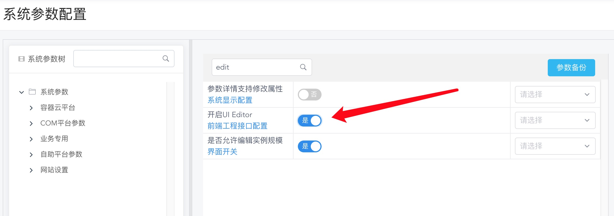
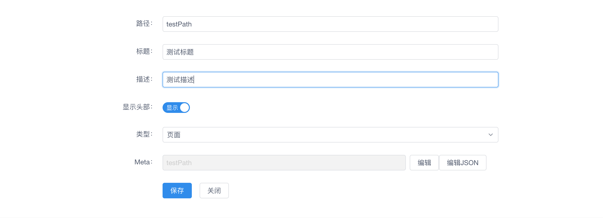
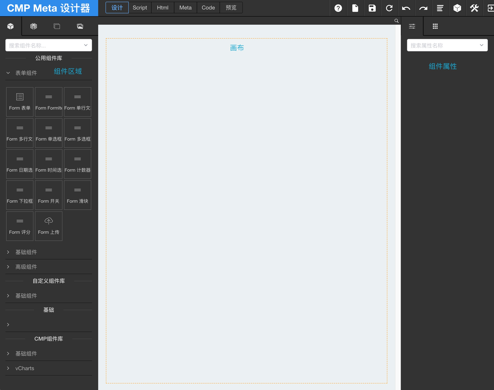
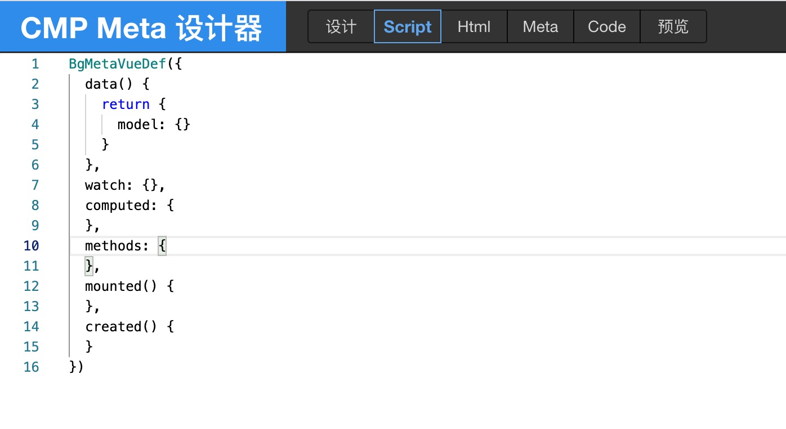
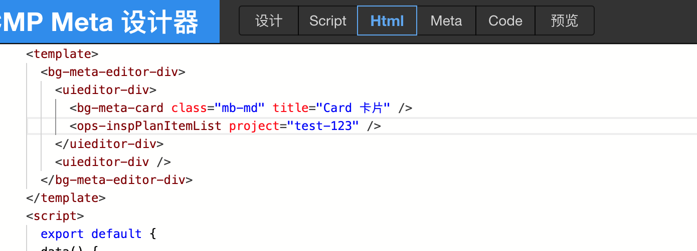

## CMP设计器简单介绍

### 编辑器模块引入
    "@cmp/metarender": "4.9",
    "@cmp/metaui": "4.9"

###  入口文件注入配置
    CmpMetaUi.startUp({
        module: 'cmp-bingo-ops',  //模块名称
        route: '/ops/metarender', //模块路由入口
        prefixPath: 'ops',
        mixins: [CmpCoreMixin, CmpSystemMixin,OPSMixin]
    });

### 创建meta业务页面
**cmd+shift+click** 进入配置页面
**全局开关** 

地址栏:/ops/metarender?path=xxxx

### 编辑器

##  业务页面
### 业务页面组成
   >业务页面组成
   >>page          **存储主体页面**

   >>meta          **存储业务逻辑**  
 
## 生命周期  
### vue生命周期 
 
### 设计器      
 

## 自定义组件
### 组件由载体模块导出
    export const CmpOPSModule: IWebModule = {
        components:{
            "ops-inspPlanItemList":inspPlanItemList,
            "ops-inspPlanReportList":inspPlanReportList,
            "ops-inspPlanBatchList":inspPlanBatchList
        }
    };
    export default CmpOPSModule;

 

### 组件在左侧菜单添加
        @CmpVueComponent({
        mixins: [CmpCoreMixin],
        metarender: {
            editor: {
            group: 'vCharts', text: 'IaasTest', order: 1,
            icon: 'bingo-subnet',
            disabledAttr: true,
            attrs: {
                checkVal: {
                group: '组件',
                groupOrder: 1,
                order: 1,
                type: 'boolean',
                bind: true
                },
                'projectId,regionId,imageId,zoneCode': {
                group: "组件",
                enabledBind: true,
                order: 3
                },
                'on-change': {
                group: "组件",
                order: 30,
                event: true
                }
            }
            }
        }
        })